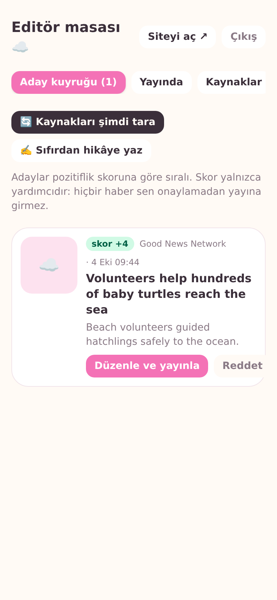

# Pamuk Haber ☁️

Yalnızca güzel ve iç ısıtan haberlerin, TikTok benzeri dikey kaydırmalı kartlarla sunulduğu mobil öncelikli site.

- **Okur tarafı:** Tam ekran kartlar, kategori sekmeleri, çift dokunarak beğenme, paylaşım bağlantıları, bülten kaydı, ana ekrana eklenebilir (PWA).
- **Editör tarafı (`/admin`):** RSS kaynaklarından otomatik toplanan adaylar pozitiflik skoruna göre sıralanır; **hiçbir haber editör onayı olmadan yayına girmez.** Editör Türkçe başlık + özet yazar, kategori ve görsel/video seçer.
- **Gelir altyapısı:** Açıkça etiketli sponsorlu kartlar, bülten aboneleri, "Destek ol" bağlantısı.

<p>
  
  
  
</p>

İçerik kaynakları, gelir modeli, operasyon ve yol haritası için: **[docs/STRATEJI.md](docs/STRATEJI.md)**

## Hızlı başlangıç

```bash
npm install
cp .env.example .env.local      # ADMIN_PASSWORD'ü doldurun
npm run setup                   # veritabanını oluşturur + kaynakları ve örnek hikâyeleri ekler
npm run dev                     # http://localhost:3000
```

Editör paneli: http://localhost:3000/admin (şifre: `ADMIN_PASSWORD`).

> Örnek hikâyeler akışta **"Örnek içerik"** etiketiyle görünür ve gerçek haber değildir. Panelin "Yayında" sekmesinden tek tıkla silinebilir. Hiç eklemek istemiyorsanız: `npm run db:seed -- --no-demo`.

## Komutlar

| Komut | Ne yapar |
|---|---|
| `npm run dev` | Geliştirme sunucusu |
| `npm run build` / `npm start` | Üretim derlemesi / sunucusu |
| `npm run setup` | `db:migrate` + `db:seed` |
| `npm run db:migrate` | `drizzle/` içindeki migration'ları uygular |
| `npm run db:generate` | `src/db/schema.ts` değişince yeni migration üretir |
| `npm run ingest` | RSS kaynaklarını tarayıp aday kuyruğunu doldurur |
| `npm test` / `npm run lint` / `npm run typecheck` | Testler ve kontroller |

## Mimari

```
src/
  app/
    page.tsx               Akış (ilk sayfa sunucuda render edilir)
    h/[slug]/page.tsx      Paylaşım bağlantısı: önce o hikâye, sonra akış (+ OG etiketleri)
    hakkinda/              Misyon, editoryal ilkeler, destek
    admin/                 Editör paneli (giriş, aday kuyruğu, hikâye formu, kaynaklar, aboneler)
    api/stories            Sayfalı akış (cursor), ?kategori= filtresi
    api/stories/[id]/like  Beğeni sayacı
    api/subscribe          Bülten kaydı
    api/cron/ingest        Zamanlanmış RSS taraması (CRON_SECRET korumalı)
  components/              Feed, StoryCard, StoryMedia, NewsletterCard, EndCard, TopBar
  db/                      Drizzle şeması, bağlantı, seed
  lib/                     ingest (RSS), positivity (skor), validation, session/auth, feed düzeni
  proxy.ts                 /admin ve /api/admin yollarını oturum çereziyle korur
drizzle/                   SQL migration'ları
tests/                     Vitest birim/entegrasyon testleri
```

- **Veritabanı:** SQLite (libSQL). Yerelde `file:./data/pamuk.db`; canlıda [Turso](https://turso.tech) — aynı sürücü, yalnızca `DATABASE_URL` değişir.
- **Medya türleri:** Görsel URL, dikey MP4 video (görünürken sessiz otomatik oynar), YouTube/Shorts embed, ya da medya yoksa kategoriye özel pastel degrade.
- **Kimlik doğrulama:** Tek editör şifresi (`ADMIN_PASSWORD`), `AUTH_SECRET` ile imzalı HttpOnly JWT çerezi. Sunucu eylemleri oturumu ayrıca doğrular.

## Canlıya alma (Vercel + Turso)

1. Turso'da veritabanı oluşturun: `turso db create pamukhaber`, URL ve token alın.
2. Yerelden migration ve seed: `DATABASE_URL=libsql://... DATABASE_AUTH_TOKEN=... npm run setup`
3. Projeyi Vercel'e bağlayın; ortam değişkenlerini girin: `DATABASE_URL`, `DATABASE_AUTH_TOKEN`, `ADMIN_PASSWORD`, `AUTH_SECRET` (`openssl rand -base64 32`), `CRON_SECRET`, `NEXT_PUBLIC_SITE_URL`, isteğe bağlı `NEXT_PUBLIC_SUPPORT_URL`, `NEXT_PUBLIC_CONTACT_EMAIL`.
4. `vercel.json` günde bir RSS taraması tanımlar. Daha sık tarama için GitHub deposunda `SITE_URL` ve `CRON_SECRET` sırlarını tanımlayın; `.github/workflows/ingest.yml` günde 4 kez tarar.

> Vercel'de `file:` SQLite kalıcı değildir; canlıda mutlaka Turso (veya başka bir libSQL sunucusu) kullanın.

## Kaynaklar hakkında not

`src/lib/sources.ts` başlangıç RSS listesini içerir. Bu adresler geliştirme ortamında ağ kısıtı nedeniyle canlı olarak denenemedi; ilk taramadan sonra panelin **Kaynaklar** sekmesinde hata veren kaynak varsa adresini güncelleyin veya kapatın. Yeni kaynaklar da aynı sekmeden eklenebilir.
