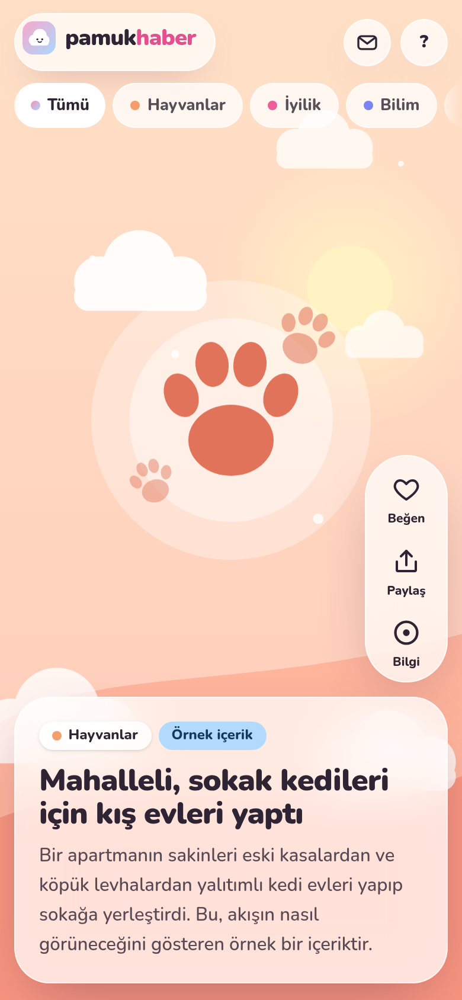
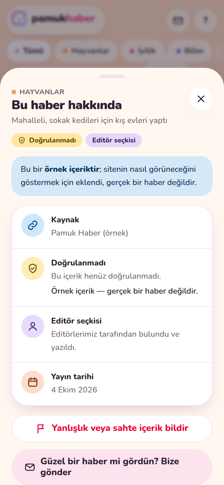
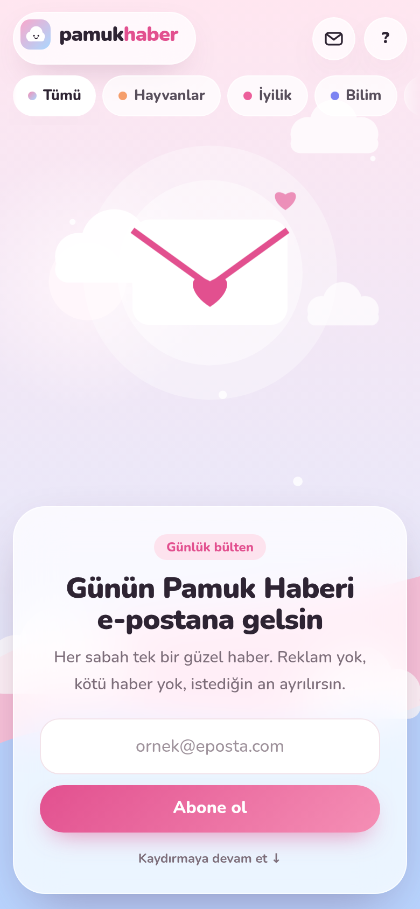
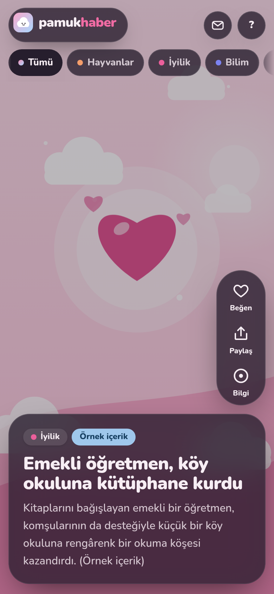

# Pamuk Haber ☁️

Yalnızca güzel ve iç ısıtan haberlerin, TikTok benzeri dikey kaydırmalı kartlarla sunulduğu mobil öncelikli site.

- **Okur tarafı:** Tam ekran kartlar, kategori sekmeleri, çift dokunarak beğenme, paylaşım bağlantıları, bülten kaydı, ana ekrana eklenebilir (PWA). Görsel, MP4, **YouTube/Shorts, TikTok ve Instagram Reels** gömme desteği.
- **Şeffaflık:** Her kartta **yuvarlak içinde nokta** düğmesi: kaynak ve ek kaynaklar, doğrulama durumu (Doğrulandı / Kaynağa dayalı / Doğrulanmadı), haberi kimin getirdiği (editör / okur / kurum), yapay zekâ desteği bilgisi ve **yanlış bilgi / sahte içerik bildirme**. Aynı hikâyeye 3 farklı okur bildirimde bulunursa hikâye editör incelemesine kadar gizlenir.
- **Kategoriler:** Hayvanlar, İyilik, Sevgi, Bilim, Doğa, Sağlık, Başarı, Topluluk; bir haber en fazla 3 kategoride yer alabilir (ilki ana kategori). Videolu kartlarda metin kısa bir tanıtımdan sonra küçülür, dokununca açılır.
- **Okur gönderimi (`/gonder`):** Okurlar haber bağlantısı gönderir; editör kuyruğuna "Okur" rozetiyle düşer.
- **Editör tarafı (`/admin`):** RSS kaynaklarından otomatik toplanan adaylar pozitiflik skoruna göre sıralanır; **hiçbir haber editör onayı olmadan yayına girmez.** Editör Türkçe başlık + özet yazar, kategori ve görsel/video seçer. **Gemini** ile tek tıkla Türkçe taslak ve "başka kaynaklarda ara" doğrulama yardımı (isteğe bağlı).
- **Gelir altyapısı:** Açıkça etiketli sponsorlu kartlar, bülten aboneleri, "Destek ol" bağlantısı.

<p>
  
  
  
  
</p>

İçerik kaynakları, gelir modeli, operasyon ve yol haritası için: **[docs/STRATEJI.md](docs/STRATEJI.md)**

## Hızlı başlangıç

```bash
npm install
cp .env.example .env.local      # ADMIN_PASSWORD'ü doldurun
npm run setup                   # veritabanını oluşturur + kaynakları ve örnek hikâyeleri ekler
npm run dev                     # http://localhost:3000
```

Editör paneli: http://localhost:3000/admin (şifre: `ADMIN_PASSWORD`).

> Örnek hikâyeler akışta **"Örnek içerik"** etiketiyle görünür ve gerçek haber değildir. Panelin "Yayında" sekmesinden tek tıkla silinebilir. Hiç eklemek istemiyorsanız: `npm run db:seed -- --no-demo`.

## Komutlar

| Komut | Ne yapar |
|---|---|
| `npm run dev` | Geliştirme sunucusu |
| `npm run build` / `npm start` | Üretim derlemesi / sunucusu |
| `npm run setup` | `db:migrate` + `db:seed` |
| `npm run db:migrate` | `drizzle/` içindeki migration'ları uygular |
| `npm run db:generate` | `src/db/schema.ts` değişince yeni migration üretir |
| `npm run ingest` | RSS kaynaklarını tarayıp aday kuyruğunu doldurur |
| `npm test` / `npm run lint` / `npm run typecheck` | Testler ve kontroller |

## Mimari

```
src/
  app/
    page.tsx               Akış (ilk sayfa sunucuda render edilir)
    h/[slug]/page.tsx      Paylaşım bağlantısı: önce o hikâye, sonra akış (+ OG etiketleri)
    hakkinda/              Misyon, editoryal ilkeler, şeffaflık, destek
    gonder/                Okur haber gönderme formu
    admin/                 Editör paneli (giriş, aday kuyruğu, hikâye formu + AI, yayında, bildirimler, kaynaklar, aboneler)
    api/stories            Sayfalı akış (cursor), ?kategori= filtresi
    api/stories/[id]/like  Beğeni sayacı
    api/stories/[id]/report  Okur bildirimi (eşikte otomatik gizleme)
    api/subscribe          Bülten kaydı
    api/cron/ingest        Zamanlanmış RSS taraması (CRON_SECRET korumalı)
  components/              Feed, StoryCard, StoryMedia (gömmeler), StoryInfoSheet (bilgi + bildirim), NewsletterCard, EndCard, TopBar
  db/                      Drizzle şeması, bağlantı, seed
  lib/                     ingest (RSS), positivity (skor), validation, media (gömme linkleri), ai (Gemini),
                           reports, submissions, session/auth, feed düzeni
  proxy.ts                 /admin ve /api/admin yollarını oturum çereziyle korur
drizzle/                   SQL migration'ları
tests/                     Vitest birim/entegrasyon testleri
```

- **Veritabanı:** SQLite (libSQL). Yerelde `file:./data/pamuk.db`; canlıda [Turso](https://turso.tech) — aynı sürücü, yalnızca `DATABASE_URL` değişir.
- **Medya türleri:** Görsel URL, dikey MP4 video (görünürken sessiz otomatik oynar), YouTube/Shorts, TikTok ve Instagram Reels gömme (paylaşım linkiyle; `vm.tiktok.com` kısa linkleri kaydederken çözülür), ya da medya yoksa kategoriye özel pastel degrade.
  - Gömülü oynatıcılar dokunmaları yuttuğu için üstlerinde şeffaf bir katman vardır; kaydırma akışa gider. "Oynatıcıyı kullan / Oynat" ile katman kalkar, "Kaydırmaya dön" ile geri gelir.
  - Instagram gömmeleri otomatik oynamaz (platform kısıtı). Video sahibi gömmeyi kapattıysa ya da hesap gizliyse içerik görünmez.
- **Yapay zekâ (Gemini):** `GEMINI_API_KEY` tanımlıysa hikâye formunda iki düğme çıkar: *Taslak* (haber sayfasını okuyup Türkçe başlık/özet/kategori, teyit edilmesi gereken iddialar ve uyarılar önerir) ve *Başka kaynaklarda ara* (Google Search grounding ile bağımsız kaynak arar). Çıktı yalnızca öneridir; yayın kararı editördedir ve okura "yapay zekâ desteğiyle hazırlandı" bilgisi gösterilir. Varsayılan olarak Google'ın güncel takma adı `gemini-flash-latest` (olmazsa `gemini-flash-lite-latest`) kullanılır; `GEMINI_MODEL` ile belirli bir model seçilebilir. Netlify ücretsiz planının 10 sn sınırına sığmak için istek ~8,5 sn ile sınırlıdır; hatalar editöre ayrıntısıyla gösterilir ve Netlify fonksiyon loglarına yazılır.
- **Kötüye kullanım önlemleri:** Bildirim ve okur gönderimlerinde kişiyi ayırt etmek için IP + tarayıcı bilgisi gizli tuzla tek yönlü özetlenir (ham hâli saklanmaz). Okur gönderimlerinde günde 5 sınır ve bal küpü alanı; sunucu, okurun verdiği adresi çekmeden önce yerel ağ/IP adreslerini reddeder (SSRF koruması).
- **Tasarım ("Pamuk Bulut"):** Nunito yazı tipi (`@fontsource-variable/nunito`, derlemede ağ gerektirmez), `globals.css`'teki renk token'ları ve ortak sınıflar (`.card`, `.glass`, `.btn-*`, `.input`, `.chip`, `.choice`), medyasız haberler için kategoriye özel SVG illüstrasyonlar (`components/CategoryArt.tsx`), açık/karanlık mod.
- **Masaüstü düzeni (≥1024px):** solda logo ve kategoriler, ortada telefon çerçevesinde kayan akış ve yukarı/aşağı düğmeleri, geniş ekranda (≥1280px) sağda bülten / haber gönder / klavye ipuçları. ↑ ↓, J/K, PageUp/PageDown ve boşlukla gezinme; arka plan aktif haberin kategorisine göre değişir.
- **Kimlik doğrulama:** Tek editör şifresi (`ADMIN_PASSWORD`), `AUTH_SECRET` ile imzalı HttpOnly JWT çerezi. Sunucu eylemleri oturumu ayrıca doğrular.

- **Sahneler (Remotion):** Medyası olmayan haberler tarayıcıda canlı oynayan 9:16 videolara dönüşür (`src/remotion/`): başlık kelime kelime girer, özet 3 parçaya bölünür, her parça kendi çizimiyle (`scene-data.ts` anahtar kelimeden motif seçer) gelir. Oynatıcı yalnızca ekrandaki kartta yüklenir (`@remotion/player`); `prefers-reduced-motion` açıksa eski metin paneli gösterilir. İsteğe bağlı MP4 için `video/` paketi ve `.github/workflows/video.yml` (Actions → "Haber videosu (MP4)" → slug yazın → çıktıyı indirin) ya da yerelde `cd video && npm i && SITE_URL=https://siteniz npm run video -- <slug>` kullanılır (Chromium gerekir; `CHROME_PATH` ile belirtilebilir).
- **Görseller:** Görselli kartlarda görsel, metin panelinin üstündeki alana kırpılmadan sığar; dokununca tam ekran açılır (Esc ile kapanır).
- **Ayarlar:** Editör panelindeki **Ayarlar** sekmesi (destek bağlantısı, e-posta, Gemini modeli, GitHub deposu) `settings` tablosuna yazar; yeniden yayın gerektirmez.

> **Remotion lisansı:** Bireyler ve en fazla 3 çalışanlı şirketler için ücretsizdir (oynatıcı dahil). 4 veya daha çok çalışanlı bir şirket olursanız Remotion şirket lisansı gerekir: https://www.remotion.dev/license

## Canlıya alma

**Adım adım, ücretsiz kurulum (Netlify + Turso): [docs/YAYINLAMA.md](docs/YAYINLAMA.md)** (yayın kredisi disiplini ve `yayin` dalı dahil) — `netlify.toml` derlemede veritabanı tablolarını otomatik kurar ve (boşsa) örnek içerik ekler.

### Alternatif: Vercel + Turso

1. Turso'da veritabanı oluşturun: `turso db create pamukhaber`, URL ve token alın.
2. Yerelden migration ve seed: `DATABASE_URL=libsql://... DATABASE_AUTH_TOKEN=... npm run setup`
3. Projeyi Vercel'e bağlayın; ortam değişkenlerini girin: `DATABASE_URL`, `DATABASE_AUTH_TOKEN`, `ADMIN_PASSWORD`, `AUTH_SECRET` (`openssl rand -base64 32`), `CRON_SECRET`, `NEXT_PUBLIC_SITE_URL`, isteğe bağlı `GEMINI_API_KEY`, `GEMINI_MODEL`, `REPORT_HIDE_THRESHOLD`, `NEXT_PUBLIC_SUPPORT_URL`, `NEXT_PUBLIC_CONTACT_EMAIL`.
4. `vercel.json` günde bir RSS taraması tanımlar. Daha sık tarama için GitHub deposunda `SITE_URL` ve `CRON_SECRET` sırlarını tanımlayın; `.github/workflows/ingest.yml` günde 4 kez tarar.

> Vercel'de `file:` SQLite kalıcı değildir; canlıda mutlaka Turso (veya başka bir libSQL sunucusu) kullanın.

## Kaynaklar hakkında not

`src/lib/sources.ts` başlangıç RSS listesini içerir. Bu adresler geliştirme ortamında ağ kısıtı nedeniyle canlı olarak denenemedi; ilk taramadan sonra panelin **Kaynaklar** sekmesinde hata veren kaynak varsa adresini güncelleyin veya kapatın. Yeni kaynaklar da aynı sekmeden eklenebilir.
